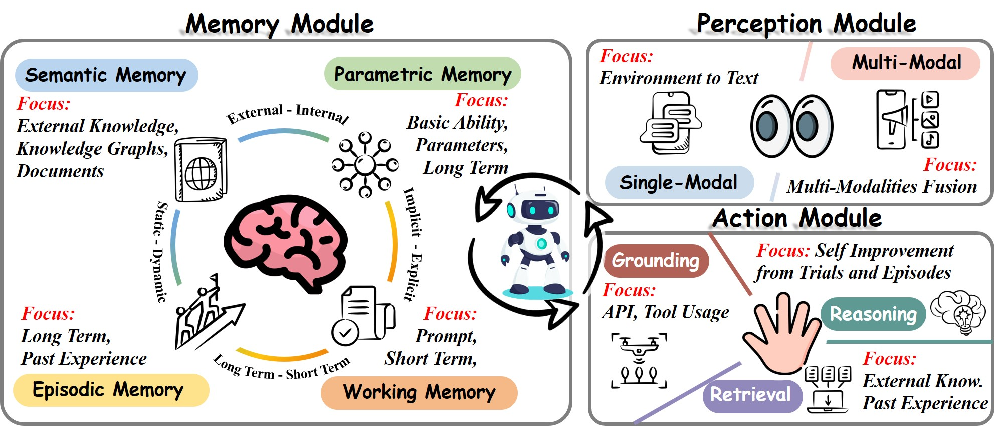

# Lifelong Learning of Large Language Model based Agents: A Roadmap

[](https://arxiv.org/pdf/2501.07278)

Welcome to the repository accompanying our survey paper on **Lifelong Learning of Large Language Model based Agents: A Roadmap**. This repository collects awesome paper for lifelong learning (also known as, continual learning and incremental learning) of LLM agent. We identify three key modules-Perception, Memory, and Action-that are integral to agent's ability to perform lifelong learning. Please refer to [this survey](https://arxiv.org/pdf/2501.07278) for detailed introduction. Additionally, for other papers, surveys, and resources on lifelong learning (continual learning, incremental learning) of LLMs, you can refer to [this repository](https://github.com/zzz47zzz/awesome-lifelong-learning-methods-for-llm). A chinese version of this README is provided in [this file](./README_chinese.md).

## 📢 News

- **2025.01**: The interpretation of this survey is available on [PaperWeekly](https://mp.weixin.qq.com/s/svub9VZGXkbFWH2A7p91SQ) and [知乎](https://zhuanlan.zhihu.com/p/20703148682)!

- **2025.01**: We released a survey paper "[Lifelong Learning of Large Language Model based Agents: A Roadmap](https://arxiv.org/pdf/2501.07278)". Feel free to cite or open pull requests.





## 📒 Table of Contents


## Perception Module
### Single-Modal Perception
|Title|Venue|Date|
|:---|:---|:---|
|[AgentOccam: A Simple Yet Strong Baseline for LLM-Based Web Agent](https://arxiv.org/pdf/2410.13825?)|arXiv|2024-10|
|[GPT-4V(ision) is a Generalist Web Agent, if Grounded](https://arxiv.org/pdf/2401.01614.pdf)|ICLR|2024-01|
|[Webarena: A realistic web environment for building autonomous agents](https://arxiv.org/pdf/2307.13854)|ICLR|2023-07|
|[Synapse: Trajectory-asexemplar prompting with memory for computer control](https://openreview.net/pdf?id=Pc8AU1aF5e)|ICLR|2023-06|
|[Multimodal web navigation with instruction-finetuned foundation models](https://arxiv.org/pdf/2305.11854)|ICLR|2023-05|
### Multi-Modal Perception
|Title|Venue|Date|
|:---|:---|:---|
|[Llms can evolve continually on modality for x-modal reasoning](https://arxiv.org/pdf/2410.20178)|NeurIPS|2024-10|
|[Modaverse: Efficiently transforming modalities with llms](https://openaccess.thecvf.com/content/CVPR2024/papers/Wang_ModaVerse_Efficiently_Transforming_Modalities_with_LLMs_CVPR_2024_paper.pdf)|CVPR|2024-01|
|[Omnivore: A single model for many visual modalities](https://arxiv.org/PDF/2201.08377)|CVPR|2022-01|
|[Perceiver: General perception with iterative attention](http://proceedings.mlr.press/v139/jaegle21a/jaegle21a.pdf)|ICML|2021-07|
|[Vatt: Transformers for multimodal self-supervised learning from raw video, audio and text](https://proceedings.neurips.cc/paper_files/paper/2021/file/cb3213ada48302953cb0f166464ab356-Paper.pdf)|NeurIPS|2021-04|
## Memory Module
### Working Memory
|Title|Venue|Date|
|:---|:---|:---|
|[Character-llm: A trainable agent for role-playing](https://arxiv.org/pdf/2310.10158)|EMNLP|2023-10|
|[Connecting Large Language Models with Evolutionary Algorithms Yields Powerful Prompt Optimizers](https://arxiv.org/pdf/2309.08532)|ICLR|2023-09|
|[Adapting Language Models to Compress Contexts](https://arxiv.org/pdf/2305.14788)|ACL|2023-05|
|[Critic: Large language models can self-correct with tool-interactive critiquing}](https://arxiv.org/pdf/2305.11738)|NeurIPS Workshop|2023-05|
|[Cogltx: Applying bert to long texts](https://proceedings.neurips.cc/paper_files/paper/2020/file/96671501524948bc3937b4b30d0e57b9-Paper.pdf)|NeurIPS|2020-12|
### Episodic Memory
|Title|Venue|Date|
|:---|:---|:---|
|[DelTA: An Online Document-Level Translation Agent Based on Multi-Level Memory](https://arxiv.org/pdf/2410.08143)|arXiv|2024-10|
|[MemoChat: Tuning LLMs to Use Memos for Consistent Long-Range Open-Domain Conversation](https://arxiv.org/pdf/2308.08239)|arXiv|2023-08|
|[RET-LLM: Towards a General Read-Write Memory for Large Language Models](https://arxiv.org/abs/2305.14322)|ICLR|2023-05|
|[Bring Evanescent Representations to Life in Lifelong Class Incremental Learning](https://openaccess.thecvf.com/content/CVPR2022/papers/Toldo_Bring_Evanescent_Representations_to_Life_in_Lifelong_Class_Incremental_Learning_CVPR_2022_paper.pdf)|CVPR|2022-06|
|[iCaRL: Incremental Classifier and Representation Learning](https://openaccess.thecvf.com/content_cvpr_2017/papers/Rebuffi_iCaRL_Incremental_Classifier_CVPR_2017_paper.pdf)|CVPR|2017-04|
### Semantic Memory
|Title|Venue|Date|
|:---|:---|:---|
|[Fast and Continual Knowledge Graph Embedding via Incremental LoRA](https://arxiv.org/pdf/2407.05705?)|IJCAL|2024-07|
|[PromptDSI: Prompt-based Rehearsal-free Instance-wise Incremental Learning for Document Retrieval](https://arxiv.org/pdf/2406.12593)|arXiv|2024-06|
|[CorpusBrain++: A Continual Generative Pre-Training Framework for Knowledge-Intensive Language Tasks](https://arxiv.org/pdf/2402.16767)|arXiv|2024-02|
|[Continual Multimodal Knowledge Graph Construction](https://arxiv.org/pdf/2305.08698)|IJCAI|2023-05|
|[Lifelong embedding learning and transfer for growing knowledge graphs](https://ojs.aaai.org/index.php/AAAI/article/view/25539/25311)|AAAI|2022-11|
### Parametric Memory
|Title|Venue|Date|
|:---|:---|:---|
|[ELDER: Enhancing Lifelong Model Editing with Mixture-of-LoRA](https://arxiv.org/pdf/2408.11869)|arXiv|2024-08|
|[WISE: Rethinking the Knowledge Memory for Lifelong Model Editing of Large Language Models](https://arxiv.org/pdf/2405.14768)|NeurIPS|2024-05|
|[WilKE: Wise-Layer Knowledge Editor for Lifelong Knowledge Editing](https://arxiv.org/pdf/2402.10987)|ACL|2024-02|
|[Aging with GRACE: Lifelong Model Editing with Key-Value Adaptors](https://openreview.net/pdf?id=ngCT1EelZk)|ICLR|2022-11|
|[Plug-and-Play Adaptation for Continuously-updated QA](https://arxiv.org/pdf/2204.12785)|ACL|2022-04|
## Action Module
### Grounding Actions
#### Tool Environment
|Title|Venue|Date|
|:---|:---|:---|
|[LLMs in the Imaginarium: Tool Learning through Simulated Trial and Error](https://aclanthology.org/2024.acl-long.570.pdf)|ACL|2024-03|
|[EASYTOOL: Enhancing LLM-based Agents with Concise Tool Instruction](https://arxiv.org/pdf/2401.06201)|ICLR Workshop|2024-01|
|[Confucius: Iterative Tool Learning from Introspection Feedback by Easy-to-Difficult Curriculum](https://ojs.aaai.org/index.php/AAAI/article/view/29759)|AAAI|2023-08|
|[GEAR: Augmenting Language Models with Generalizable and Efficient Tool Resolution](https://arxiv.org/pdf/2307.08775)|EACL|2023-07|
|[ToolLLM: Facilitating Large Language Models to Master 16000+ Real-world APIs](https://arxiv.org/pdf/2307.16789)|ICLR|2023-07|
|[Large Language Models as Tool Makers](https://arxiv.org/pdf/2305.17126)|ICLR|2023-05|
|[Toolformer: Language Models Can Teach Themselves to Use Tools](https://openreview.net/pdf?id=Yacmpz84TH)|NeurIPS|2023-05|
|[ToolkenGPT: Augmenting Frozen Language Models with Massive Tools via Tool Embeddings](https://openreview.net/pdf?id=BHXsb69bSx)|NeurIPS|2023-05|
|[On the Tool Manipulation Capability of Open-source Large Language Models](https://arxiv.org/pdf/2305.16504)|arXiv|2023-05|
|[ART: Automatic multi-step reasoning and tool-use for large language models](https://arxiv.org/pdf/2303.09014)|arXiv|2023-03|
#### Web Environment
|Title|Venue|Date|
|:---|:---|:---|
|[AgentOccam: A Simple Yet Strong Baseline for LLM-Based Web Agent](https://arxiv.org/pdf/2410.13825?)|arXiv|2024-10|
|[WebPilot: A Versatile and Autonomous Multi-Agent System for Web Task Execution with Strategic Exploration](https://arxiv.org/pdf/2408.15978)|arXiv|2024-08|
|[SteP: Stacked LLM Policies for Web Actions](https://openreview.net/pdf?id=5fg0VtRxgi)|COLM|2024-07|
|[LASER: LLM Agent with State-Space Exploration for Web Navigation](https://arxiv.org/pdf/2309.08172)|NeurIPS Workshop|2023-09|
|[Large Language Models Are Semi-Parametric Reinforcement Learning Agent](https://proceedings.neurips.cc/paper_files/paper/2023/file/f6b22ac37beb5da61efd4882082c9ecd-Paper-Conference.pdf)|NeurIPS|2023-06|
#### Game Environment
|Title|Venue|Date|
|:---|:---|:---|
|[VillagerAgent: A Graph-Based Multi-Agent Framework for Coordinating Complex Task Dependencies in Minecraft](https://arxiv.org/pdf/2406.05720)|ACL|2024-06|
|[See and Think: Embodied Agent in Virtual Environment](https://arxiv.org/pdf/2311.15209)|ECCV|2023-11|
|[JARVIS-1: Open-World Multi-task Agents with Memory-Augmented Multimodal Language Models](https://arxiv.org/pdf/2311.05997)|TPAMI|2023-11|
|[Voyager: An Open-Ended Embodied Agent with Large Language Models](https://arxiv.org/pdf/2305.16291)|arXiv|2023-05|
|[Describe, Explain, Plan and Select: Interactive Planning with Large Language Models Enables Open-World Multi-Task Agents](https://arxiv.org/pdf/2302.01560)|NeurIPS|2023-02|
### Retrieval Actions
#### Retrieval from Semantic memory
|Title|Venue|Date|
|:---|:---|:---|
|[See and Think: Embodied Agent in Virtual Environment](https://arxiv.org/pdf/2311.15209)|ECCV|2023-11|
|[Ghost in the Minecraft: Generally Capable Agents for Open-World Environments via Large Language Models with Text-based Knowledge and Memory](https://arxiv.org/pdf/2305.17144)|arXiv|2023-05|
|[Planning with Large Language Models via Corrective Re-prompting](https://openreview.net/pdf?id=cMDMRBe1TKs)|NeurIPS Workshop|2022-10|
|[Language Models as Zero-Shot Planners: Extracting Actionable Knowledge for Embodied Agents](https://proceedings.mlr.press/v162/huang22a/huang22a.pdf)|ICML|2022-01|
#### Retrieval from Episodic memory
|Title|Venue|Date|
|:---|:---|:---|
|[VLM Agents Generate Their Own Memories: Distilling Experience into Embodied Programs](https://arxiv.org/pdf/2406.14596)|arXiv|2024-06|
|[Large Language Models as Tool Makers](https://arxiv.org/pdf/2305.17126)|ICLR|2023-05|
|[On the Tool Manipulation Capability of Open-source Large Language Models](https://arxiv.org/pdf/2305.16504)|arXiv|2023-05|
|[Voyager: An Open-Ended Embodied Agent with Large Language Models](https://arxiv.org/pdf/2305.16291)|arXiv|2023-05|
|[ART: Automatic multi-step reasoning and tool-use for large language models](https://arxiv.org/pdf/2303.09014)|arXiv|2023-03|
### Reasoning Actions
#### Intra-Episodic Memory
|Title|Venue|Date|
|:---|:---|:---|
|[Reasoning with Language Model is Planning with World Model](https://arxiv.org/pdf/2305.14992)|EMNLP|2023-05|
|[Large Language Models as Commonsense Knowledge for Large-Scale Task Planning](https://proceedings.neurips.cc/paper_files/paper/2023/file/65a39213d7d0e1eb5d192aa77e77eeb7-Paper-Conference.pdf)|NeurIPS|2023-05|
|[Tree of Thoughts: Deliberate Problem Solving with Large Language Models](https://proceedings.neurips.cc/paper_files/paper/2023/file/271db9922b8d1f4dd7aaef84ed5ac703-Paper-Conference.pdf)|NeurIPS|2023-05|
|[SwiftSage: A Generative Agent with Fast and Slow Thinking for Complex Interactive Tasks](https://proceedings.neurips.cc/paper_files/paper/2023/file/4b0eea69deea512c9e2c469187643dc2-Paper-Conference.pdf)|NeurIPS2023|2023-05|
|[Reflexion: Language Agents with Verbal Reinforcement Learning](https://proceedings.neurips.cc/paper_files/paper/2023/file/1b44b878bb782e6954cd888628510e90-Paper-Conference.pdf)|NeurIPS|2023-03|
|[ReAct: Synergizing Reasoning and Acting in Language Models](https://arxiv.org/pdf/2210.03629)|ICLR|2022-10|
#### Inter-Episodic Memory
|Title|Venue|Date|
|:---|:---|:---|
|[VLM Agents Generate Their Own Memories: Distilling Experience into Embodied Programs](https://arxiv.org/pdf/2406.14596)|arXiv|2024-06|
|[LLMs in the Imaginarium: Tool Learning through Simulated Trial and Error](https://aclanthology.org/2024.acl-long.570.pdf)|ACL|2024-03|
|[See and Think: Embodied Agent in Virtual Environment](https://arxiv.org/pdf/2311.15209)|ECCV|2023-11|
|[Large Language Models Are Semi-Parametric Reinforcement Learning Agent](https://proceedings.neurips.cc/paper_files/paper/2023/file/f6b22ac37beb5da61efd4882082c9ecd-Paper-Conference.pdf)|NeurIPS|2023-06|
|[Ghost in the Minecraft: Generally Capable Agents for Open-World Environments via Large Language Models with Text-based Knowledge and Memory](https://arxiv.org/pdf/2305.17144)|arXiv|2023-05|
|[Voyager: An Open-Ended Embodied Agent with Large Language Models](https://arxiv.org/pdf/2305.16291)|arXiv|2023-05|

## 📚 Cite Our Work

```
@article{zheng2025lifelong,
      title={Lifelong Learning of Large Language Model based Agents: A Roadmap}, 
      author={Zheng, Junhao and Shi, Chengming and Cai, Xidi and Li, Qiuke and Zhang, Duzhen and Li, Chenxing and Yu, Dong and Ma, Qianli},
      journal={arXiv preprint arXiv:2501.07278},
      year={2025},
}
```

## 😍 Star History

<a href="https://star-history.com/#qianlima-lab/awesome-lifelong-llm-agent&Date">
 <picture>
   <source media="(prefers-color-scheme: dark)" srcset="https://api.star-history.com/svg?repos=qianlima-lab/awesome-lifelong-llm-agent&type=Date&theme=dark" />
   <source media="(prefers-color-scheme: light)" srcset="https://api.star-history.com/svg?repos=qianlima-lab/awesome-lifelong-llm-agent&type=Date" />
   
 </picture>
</a>
